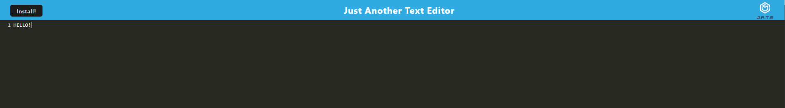

# J.A.T.E

[Deployed Application](https://dashboard.heroku.com/apps/stark-everglades-82490)

This app is an installable text editor.

## Description

This text editor was built using webpack, and other modules,  
to create a PWA application. It implements the use of a service  
worker and manifest, as well as utilizing IndexedDB.

### Installing

To install the program, open the app on heroku and click the 'Install!' button.  
Alternatively, there should be a small icon in your URL search bar that will also  
prompt you to install the program.

### Executing program

This is a basic text editor program that runs of IndexedDB and caching. You can  
use this editor in your browser, or install it locally and use it offline. All of  
your text info should be saved and should not bog down the apps performance.

### Testing

No testing currently available.

## Authors

Dylan Crowley:

[Github](https://github.com/dcrowdev)  
[Twitter](https://twitter.com/dcrowdev)  
[LinkedIn](https://www.linkedin.com/in/dylan-crowley-3974b8252/)  
dcrowdev1025@gmail.com

## License

This project is licensed under the MIT license.

## Acknowledgments

UCF Fullstack bootcamp!
